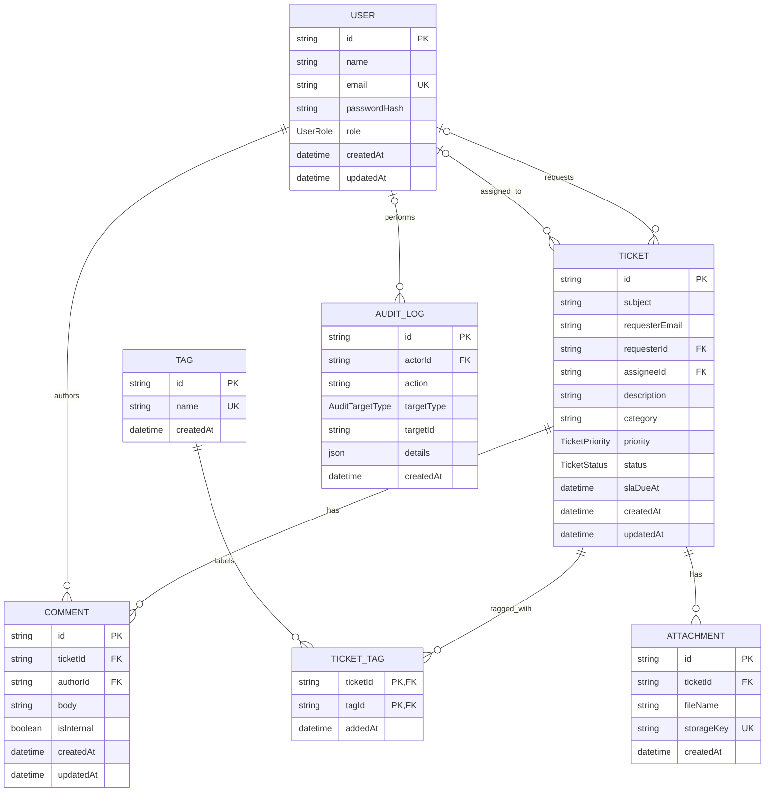

# SupportDesk ER Diagram

```mermaid
erDiagram
    USER {
        string id PK
        string name
        string email UK
        string passwordHash
        UserRole role
        datetime createdAt
        datetime updatedAt
    }

    TICKET {
        string id PK
        string subject
        string requesterEmail
        string requesterId FK
        string assigneeId FK
        string description
        string category
        TicketPriority priority
        TicketStatus status
        datetime slaDueAt
        datetime createdAt
        datetime updatedAt
    }

    COMMENT {
        string id PK
        string ticketId FK
        string authorId FK
        string body
        boolean isInternal
        datetime createdAt
        datetime updatedAt
    }

    TAG {
        string id PK
        string name UK
        datetime createdAt
    }

    TICKET_TAG {
        string ticketId PK, FK
        string tagId PK, FK
        datetime addedAt
    }

    ATTACHMENT {
        string id PK
        string ticketId FK
        string fileName
        string storageKey UK
        datetime createdAt
    }

    AUDIT_LOG {
        string id PK
        string actorId FK
        string action
        AuditTargetType targetType
        string targetId
        json details
        datetime createdAt
    }

    USER o|--o{ TICKET : requests
    USER o|--o{ TICKET : assigned_to
    TICKET ||--o{ COMMENT : has
    USER ||--o{ COMMENT : authors
    TICKET ||--o{ TICKET_TAG : tagged_with
    TAG ||--o{ TICKET_TAG : labels
    TICKET ||--o{ ATTACHMENT : has
    USER o|--o{ AUDIT_LOG : performs
```
